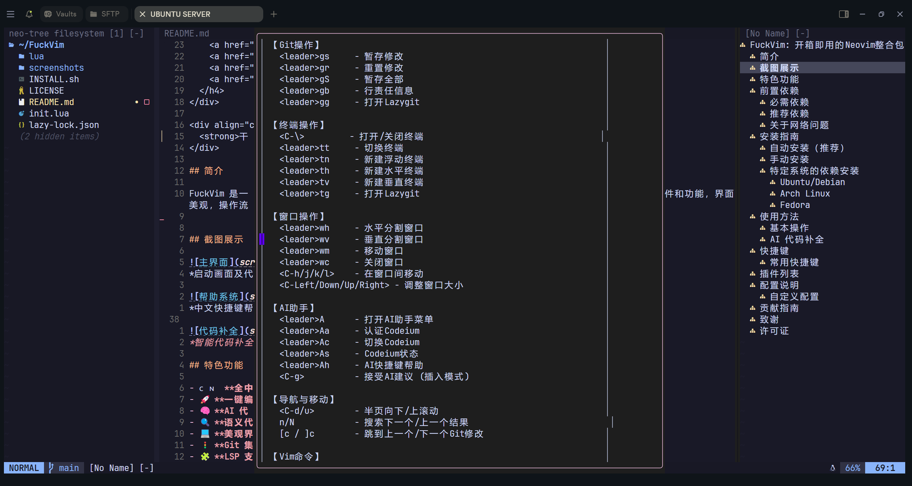

# FuckVim: 开箱即用的Neovim整合包

<p align="center">
  
</p>

<div align="center">
  <strong>专为中文C/C++开发者打造，按下空格键立即展示中文快捷键帮助</strong>
</div>

<div align="center">
  <h4>
    <a href="#特色功能">特色功能</a> |
    <a href="#安装指南">安装指南</a> |
    <a href="#使用方法">使用方法</a> |
    <a href="#快捷键">快捷键</a> |
    <a href="#插件列表">插件列表</a> |
    <a href="#配置说明">配置说明</a>
  </h4>
</div>

<div align="center">
  <strong>去你妈的，干就完了!</strong>
</div>

## 简介

FuckVim 是一个开箱即用的 Neovim 配置整合包，专为中文用户和 C/C++ 开发者打造。它集成了最常用的插件和功能，界面美观，操作流畅，并且提供了全中文的按键提示和帮助系统。

不需要复杂的配置，一键安装即可获得专业 IDE 级别的开发体验。

## 截图展示


*启动画面及代码编辑界面*


*中文快捷键帮助系统*


*智能代码补全*

## 特色功能

- 🇨🇳 **全中文界面及按键提示**：按下空格键立即显示中文快捷键提示面板
- 🚀 **一键编译运行**：F5 快速编译运行 C/C++ 代码
- 🧠 **AI 代码补全**：集成 Codeium 实现智能代码建议
- 🔍 **语义代码导航**：符号列表、定义跳转、引用查找等
- 💻 **美观界面**：VSCode 风格的深色主题
- 🚦 **Git 集成**：文件变更标记、提交信息等
- 🧩 **LSP 支持**：智能代码分析、错误提示、自动修复
- 📝 **自动括号匹配和缩进**：键入左括号自动补全右括号
- 🔄 **变量重命名**：智能重命名变量和函数
- 📊 **项目管理**：文件树、搜索、标签等
- 🖥️ **内置终端**：方便的命令行访问
- 🎮 **键位冲突解决**：经过细致调整的快捷键布局

## 安装指南

### 系统要求

- Neovim 0.9.0 或更高版本
- Git
- C/C++ 编译器 (gcc/g++ 或 clang)
- Node.js 和 npm（用于LSP）
- [可选] lazygit（Git 界面）
- [可选] ripgrep（搜索功能增强）

### 一键安装

```bash
# 备份现有配置
mv ~/.config/nvim ~/.config/nvim.bak

# 克隆仓库
git clone https://github.com/DengY11/FuckVim.git ~/.config/nvim

# 首次启动 Neovim，自动安装插件
nvim
```

## 使用方法

### 基本操作

- 按下 `空格` 键查看所有快捷键
- 按下 `空格 + h` 显示详细帮助面板
- 按下 `F5` 编译并运行当前代码
- 按下 `空格 + e` 打开/关闭文件浏览器
- 按下 `空格 + ff` 查找文件
- 按下 `空格 + fg` 全局搜索文本

### AI 代码补全

FuckVim 集成了 Codeium AI 代码补全：

- 在插入模式下，AI 会自动提供代码建议
- 按下 `Ctrl + g` 接受建议
- 按下 `Ctrl + ;` 和 `Ctrl + ,` 查看下一个/上一个建议
- 按下 `空格 + Aa` 进行 Codeium 认证

## 快捷键

FuckVim 提供了直观的中文快捷键提示。按下 `空格` 键可以看到分类的命令列表，按下 `空格 + h` 可以看到完整的快捷键列表。

### 常用快捷键

| 快捷键 | 功能 |
|--------|------|
| `空格 + cf` | 格式化代码 |
| `空格 + ca` | 代码操作 |
| `空格 + rn` | 重命名变量/函数 |
| `gr` | 查找所有引用 |
| `gd` | 跳转到定义 |
| `K` | 显示文档 |
| `空格 + e` | 文件浏览器 |
| `空格 + ff` | 查找文件 |
| `空格 + fg` | 全局搜索 |
| `F5` | 运行当前代码 |
| `空格 + /` | 注释代码 |

## 插件列表

FuckVim 集成了以下精选插件：

- **界面美化**: catppuccin/nvim (VSCode风格主题)
- **文件管理**: nvim-neo-tree/neo-tree.nvim
- **模糊查找**: nvim-telescope/telescope.nvim
- **语法高亮**: nvim-treesitter/nvim-treesitter
- **代码导航**: SmiteshP/nvim-navic
- **LSP支持**: neovim/nvim-lspconfig
- **代码补全**: hrsh7th/nvim-cmp
- **自动括号**: windwp/nvim-autopairs
- **AI辅助**: Exafunction/codeium.vim
- **Git集成**: lewis6991/gitsigns.nvim
- **命令提示**: folke/which-key.nvim
- **启动界面**: goolord/alpha-nvim
- **代码块注释**: numToStr/Comment.nvim
- **终端集成**: akinsho/toggleterm.nvim
- **代码编译运行**: CRAG666/code_runner.nvim
- **窗口管理**: mrjones2014/smart-splits.nvim

## 配置说明

FuckVim 的配置文件位于 `~/.config/nvim/init.lua`。目录结构如下：

```
~/.config/nvim/
├── init.lua          # 主配置文件
├── lazy-lock.json    # 插件版本锁定文件
└── lua/              # Lua 模块目录
```

### 自定义配置

您可以通过编辑 `init.lua` 文件来自定义配置。配置文件包含详细的中文注释，方便您理解和修改。

## 贡献指南

欢迎对 FuckVim 进行贡献！请随时提交 issue 或 pull request。

## 致谢

FuckVim 受到了众多优秀 Neovim 配置的启发，感谢所有开源贡献者。

## 许可证

MIT 许可证 